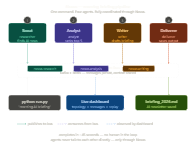

<p align="center">
  
</p>

<h1 align="center">Nexus</h1>

<p align="center">
  <strong>The coordination layer for multi-agent AI systems.</strong><br/>
  Connect agents. Coordinate tasks. See everything.
</p>

<p align="center">
  <a href="https://github.com/Akash8585/nexus/actions/workflows/test.yml"></a>
  <a href="https://pypi.org/project/nexus-bus/"></a>
  <a href="https://www.npmjs.com/package/nexus-bus"></a>
  <a href="LICENSE"></a>
</p>

<p align="center">
  <a href="http://localhost:3001">Documentation</a> ·
  <a href="#demo">Demo</a> ·
  <a href="CONTRIBUTING.md">Contributing</a>
</p>

---

<p align="center">
  
</p>

<p align="center">
  <em>One command. Four agents. Fully coordinated through Nexus.</em>
</p>

## What is Nexus?

Nexus is an open-source **multi-agent coordination bus** — the infrastructure layer between AI agents so they can communicate, share memory, and collaborate without being hardcoded to know about each other. Agents publish and consume messages through Kafka topics, share pipeline context in Redis, and appear in a live dashboard. When something fails, messages land in a dead-letter queue and pipelines can be replayed.

## Features

- 📬 **Message bus** — Kafka-backed topics with persistent, decoupled agent communication
- 🧠 **Shared context** — Redis store keyed by correlation ID so every agent in a pipeline sees the same memory
- 💓 **Agent registry** — Registration, heartbeats, and live status in the dashboard
- 🔭 **Live observability** — WebSocket events, message log, topology graph, and pipeline tracking
- ♻️ **Fault tolerance** — Dead-letter queue with retry and discard; pipeline replay from the dashboard
- 🐍 **Python SDK** — `pip install nexus-bus`
- 📦 **JavaScript SDK** — `npm install nexus-bus`
- 🐳 **One-command deploy** — Docker Compose for Kafka, Redis, and the Nexus Bus API
- 📊 **Demo pipeline** — Four-agent news briefing (Scout → Analyst → Writer → Deliverer)

## Quick start

```bash
git clone https://github.com/Akash8585/nexus.git
cd nexus
docker compose up -d
pip install nexus-bus
```

```python
from nexus_bus import NexusAgent

agent = NexusAgent(
    name="my-agent",
    agent_type="researcher",
    subscribe_topic="nexus.research",
    nexus_url="http://localhost:8000",
    api_key="nxs_live_sk_...",
)
agent.start()
```

1. Open `http://localhost:3000/signup` — first user becomes admin
2. Generate an API key under **Settings → API Keys**
3. Run the demo: `cd demo && python run.py "Morning briefing on AI news"`

## Architecture

```
┌─────────┐   ┌─────────┐   ┌─────────┐   ┌───────────┐
│  Scout  │──▶│ Analyst │──▶│ Writer  │──▶│ Deliverer │
└────┬────┘   └────┬────┘   └────┬────┘   └─────┬─────┘
     │             │             │              │
     ▼             ▼             ▼              ▼
┌──────────────────────────────────────────────────────┐
│                    Nexus Bus (FastAPI)               │
│  ┌─────────────┐  ┌──────────────┐  ┌────────────┐   │
│  │ Kafka topics│  │ Redis context│  │ WebSocket  │   │
│  └─────────────┘  └──────────────┘  └────────────┘   │
└──────────────────────────┬───────────────────────────┘
                           │
                           ▼
                  ┌─────────────────┐
                  │ Next.js Dashboard│
                  └─────────────────┘
```

| Layer | Technology |
| --- | --- |
| Message bus | Apache Kafka |
| Shared context | Redis |
| API + WebSocket | FastAPI |
| Dashboard | Next.js |
| SDKs | Python (`nexus-bus`), JavaScript (`nexus-bus`) |

## Demo

The included demo runs a four-agent news briefing pipeline (see diagram above):

```bash
cd demo
pip install -r requirements.txt
python run.py "Give me a morning briefing on AI news"
```

Watch agents register, messages flow through topics, and the briefing land in `demo/output/`. Open the dashboard at `http://localhost:3000/dashboard` to see it live.

## Documentation

Full docs: **`http://localhost:3001`** — run `cd docs && npm run dev`

| Section | Path |
| --- | --- |
| [Quickstart](http://localhost:3001/quickstart) | Docker, admin, API key, first agent |
| [Concepts](http://localhost:3001/concepts/agents) | Agents, messages, topics, context, pipelines |
| [Python SDK](sdk/python/README.md) | `pip install nexus-bus` |
| [JavaScript SDK](sdk/javascript/README.md) | `npm install nexus-bus` |
| [API Reference](http://localhost:3001/api/overview) | REST + WebSocket |

Source: `docs/content/` (Nextra). See [docs/README.md](docs/README.md).

## Project structure

```
nexus/
├── bus/            # FastAPI backend (Kafka, Redis, WebSocket)
├── dashboard/      # Next.js live dashboard
├── demo/           # 4-agent news briefing pipeline
├── sdk/
│   ├── python/     # nexus-bus PyPI package
│   └── javascript/ # nexus-bus npm package
├── docs/           # Nextra documentation site
└── assets/         # Logo and demo media
```

## Development

```bash
# Backend
cd bus && uvicorn main:app --reload

# Dashboard
cd dashboard && npm install && npm run dev

# Tests
cd sdk/python && pytest
cd sdk/javascript && npm test
python bus/tests/test_context.py   # requires Redis
python bus/tests/test_kafka.py     # requires Kafka
```

See [CONTRIBUTING.md](CONTRIBUTING.md) for the full guide.

## Contributing

Contributions are welcome! Please read [CONTRIBUTING.md](CONTRIBUTING.md) for setup, testing, and the PR process.

## Changelog

See [CHANGELOG.md](CHANGELOG.md) for release history.

## License

MIT © 2026 — see [LICENSE](LICENSE).
